# 🌩️ Tenki-Chan — Deep Technical README

> **Fokus:** *Paralelisme & Multithreading* di Unity/WebGL, arsitektur pipeline I/O, dan rekayasa ketahanan (retry, backoff, cancel) untuk **pemrosesan cuaca massal** + **LLM orchestration**. Dokumen ini hanya menjelaskan cara kerja kode (bukan panduan instalasi).

<p align="center">
  
  
  
  
</p>

---

## MAIN REPOSITORY (**[Tenki Weather](https://github.com/muhammadIdhamMaarif/Tenki-Weather)**)

---

## TL;DR

* **`MultithreadingManager`** membangun *worker pool* berbasis **coroutine** untuk menjalankan **ratusan permintaan jaringan secara konkuren** (I/O-bound). Alokasi pekerjaan aman via `Interlocked.Increment` → *lock-free*.
* **`MainProgram`** mengelola **pipeline LLM → resolusi lokasi → WeatherAPI → TTS** dengan **epoch-based cancellation** + pembatalan request in-flight.
* Di WebGL, **coroutine ≠ thread OS**: eksekusi tetap **main-thread**, tetapi **I/O paralel** terjadi via *async networking*. Ini tepat untuk tugas **I/O-bound** (memanggil API cuaca) dan aman untuk UI Unity.

---

## 1) Arsitektur Tingkat Tinggi

```mermaid
flowchart LR
  UI["UI (Unity/WebGL)"] -->|prompt user| OpenAI["OpenAI<br/>(JSON plan)"]
  OpenAI -->|intent: weather| WeatherAPI["WeatherAPI.com<br/>(current/forecast)"]
  WeatherAPI --> UI
  UI -->|teks final| ElevenLabs["ElevenLabs<br/>(TTS, Bahasa Indonesia)"]
  ElevenLabs --> UI

  %% Jalur alternatif (opsional)
  UI -.-> CloudCode["Unity Cloud Code / Relay<br/>(opsional, proxy kunci API)"] -.-> OpenAI
  UI -.-> CloudCode -.-> WeatherAPI
  UI -.-> CloudCode -.-> ElevenLabs

  %% Sorot skrip utama
  subgraph Scripts
    A["TenkiChatController<br/>(pipeline chat → cuaca → script → TTS)"]
    B["BatchWeatherProcessor<br/>(worker pool, CSV/XLSX)"]
  end
```



---

## 2) Model Paralelisme (Unity/WebGL)

> **Kunci:** `ProcessAll()` membangun **N coroutine pekerja** (*worker pool*) untuk mengeksekusi **permintaan I/O paralel** tanpa *thread OS*.

### 2.1 Worker Pool Lock-free

* **Indeks pekerjaan global**: `int idx = -1;`
* **Ambil pekerjaan** memakai **atomik** `Interlocked.Increment(ref idx)` → tiap worker mendapatkan **indeks unik** tanpa `lock`.
* **Penghitung progres**: `completed` juga di-*increment* secara atomik.
* **Tidak ada *shared mutable state*** antar pekerja, karena setiap worker **hanya menulis ke satu `KecamatanRow`** yang menjadi jatahnya.

```csharp
int idx = -1; // global
IEnumerator Worker()
{
  while (true)
  {
    int my = Interlocked.Increment(ref idx);
    if (my >= _rows.Count) yield break;         // habis
    var row = _rows[my];                        // data milik worker ini
    yield return StartCoroutine(FillWeather(row));
    Interlocked.Increment(ref completed);       // progress aman
  }
}
```

**Implikasi:**

* **Race condition** dihindari tanpa kunci (*lock-free*) → skala baik pada I/O concurrent.
* **Determinisme** data per baris terjaga (satu worker ↔ satu row), meski **urutan selesai** bisa berbeda.

### 2.2 Coroutine ≠ Thread

* Coroutine **tetap dieksekusi di main thread** pada tiap `yield`. UnityWebRequest melakukan I/O asinkron di bawah.
* **Aman** untuk UI: `statusText.text = ...` terjadi di main-thread.
* **Cocok untuk I/O-bound** (HTTP) — **tidak cocok** untuk CPU berat (mis. kompresi besar) karena itu akan **membekukan frame**.

### 2.3 Konfigurasi Paralelisme

* `maxConcurrency` (default 48) → jumlah worker (coroutine) aktif.
* **WebGL** lazimnya nyaman di **32–64** koneksi paralel; sesuaikan dengan batas browser & API.
* `maxRetries` (default 3) dengan **exponential backoff + jitter** mencegah *thundering herd* & menghormati *rate limit*.

```csharp
// backoff (maks 10s) dengan jitter [0..0.6]
float delay = Mathf.Min(10f, 0.8f * attempt + UnityEngine.Random.Range(0f, 0.6f));
```

### 2.4 Fault Tolerance (429/5xx)

* Permintaan diulang **hanya** untuk **error transient**: `req.result != Success` **atau** HTTP **429 / 5xx**.
* Error permanen → **tidak di-retry**.
* Parsing JSON dibungkus `try/catch` per baris, isolasi gagal **tanpa** memutus seluruh batch.

### 2.5 Throughput & Back-pressure

* Worker mengambil pekerjaan **on-demand** (melalui `Interlocked.Increment`), jadi **load balancing** terjadi otomatis.
* *Progress* dilaporkan tiap 50 baris untuk menghindari *UI thrash*.

---

## 3) Jalur Data `MultithreadingManager`

### 3.1 Ingest & Normalisasi Input

* **CSV**: splitter sederhana yang mendukung kutip ganda `"..."` + *locale-friendly* angka (`,` → `.`).
* **XLSX minimal**: membaca `xl/sharedStrings.xml` dan `xl/worksheets/sheet1.xml` via `ZipArchive` + **regex** (tanpa library besar). Mendukung **string & number**.
* **Pemetaan header** fleksibel (ID/EN) via pola regex case-insensitive:

  * `nameHeader = "nama|name|kecamatan"`
  * `latHeader  = "lat|latitude|lintang"`
  * `lonHeader  = "lon|lng|longitude|bujur"`

> Hasil ingest adalah `List<KecamatanRow> _rows` yang **immutable secara struktural** saat pemrosesan (hanya kolom output yang diisi per-row oleh worker masing-masing).

### 3.2 Eksekusi Paralel — `ProcessAll()`

* Mencatat waktu mulai → laporan durasi total.
* Membangun **N worker** sesuai `maxConcurrency`.
* **Setiap worker**: memanggil `FillWeather(row)` dengan retry & backoff.
* Setelah semua worker selesai → **laporan ringkas** `Done: X/Y rows in Zs`.

### 3.3 I/O Cuaca — `FillWeather()`

* Menyusun kueri `q = "lat,lon"` (format WeatherAPI).
* Memilih **relay** (`useRelay=true`) atau **direct** ke `weatherApiBaseUrl`.
* **Kriteria retry**: `429` dan `5xx` → **ulang dengan backoff**; yang lain → **selesai** (sukses/gagal parse diisolasi).
* Parse JSON minimal via `JsonUtility` → mengisi kolom hasil di `KecamatanRow`.

### 3.4 Ekspor — `BuildCsv()` & `BuildXlsx()`

* **CSV**: *escaping* aman untuk koma, kutip, dan newline.
* **XLSX minimal** (*writer*): membentuk paket OpenXML **tanpa style**:

  * `[Content_Types].xml`, `_rels/.rels`, `xl/workbook.xml`, `xl/_rels/workbook.xml.rels`, `xl/sharedStrings.xml`, `xl/worksheets/sheet1.xml`, `docProps/*`.
  * Kolom teks dipaksa `t="s"` (shared string), numerik di-encode sebagai number.
* **Catatan performa**: fungsi `S(string s)` menggunakan `List.IndexOf` → **O(U²)** untuk `uniqueCount` besar. Untuk ratusan/ribuan string **OK**; untuk puluhan ribu, ganti dengan `Dictionary<string,int>` agar **O(U)**.

### 3.5 WebGL File Bridge

* Deklarasi `DllImport("__Internal")` → `FileBridge_PickFile` & `FileBridge_DownloadText`.
* **Fallback Editor/Standalone**: menyimpan ke disk lokal.
* Trik **Base64→Latin1** supaya **bytes XLSX persis** saat dikirim lewat *text bridge*.

---

## 4) Jalur Data `MainProgram`

### 4.1 Pipeline Ber-epoch (Cancelable)

* **`_epoch`** diinkremen setiap *request* baru → seluruh coroutine lama berhenti **secara alami** (cek `if (epoch != _epoch) yield break;`).
* **`_inFlight`** menyimpan `UnityWebRequest` aktif. `CancelInFlight()` akan `Abort()` semuanya saat pengguna memicu permintaan baru.
* **Keuntungan**: bebas *race* antar *tap* cepat; tidak ada *zombie request* yang memodifikasi UI setelah usang.

### 4.2 Orkestrasi LLM → Cuaca → TTS

1. **GetTenkiPlanFromLLM**

   * Prompt **system** mendesak **output JSON ketat** sesuai skema `TenkiPlan`.
   * Respons OpenAI diparse menjadi `TenkiPlan` (schema-first, bukan *free text*).
2. **Intent switch**

   * `chitchat` → langsung tampilkan `reply`.
   * `weather` → resolusi `q` (`lat,lon` diutamakan) via `ResolveWithWeatherSearch()` jika perlu.
3. **Fetch cuaca**

   * `current` vs `forecast` dipilih dari `plan.time` / `plan.weather_api`.
4. **ResultToSpeekableText**

   * Prompt kedua (system kontrak) memaksa output **plain text Bahasa Indonesia**, 80–160 kata, **tanpa JSON/markdown**.
5. **TextToSpeechStart**

   * Kirim ke ElevenLabs → terima MP3 → tulis file sementara → `UnityWebRequestMultimedia.GetAudioClip` → `AudioSource.Play()`.

### 4.3 Keamanan Kunci & Relay

* Opsi **`UseSecureRelay`**: rute semua call ke relay (`RelayBaseUrl`) untuk menyembunyikan API key pada WebGL.
* Jika *direct*, header `Authorization: Bearer ...` hanya dikirim dari Unity.

### 4.4 UI & State Safety

* `SetInteractable(bool)` menjaga interaksi UI saat pipeline berjalan.
* `OutputWeater()` hanya membaca `result` dan `plan` lalu mengisi label UI — aman karena dieksekusi di main-thread.

---

## 5) Analisis Paralelisme & Ketahanan

### 5.1 Race Condition & Konsistensi

* **Distribusi tugas**: `Interlocked.Increment` → **satu indeks per worker**.
* **Isolasi state**: setiap `KecamatanRow` hanya diisi oleh **satu** worker → **tidak perlu lock** per field.
* **UI update**: dilakukan di main-thread (coroutine) → aman.

### 5.2 Deadlock/Livelock

* Tidak menggunakan `lock/Monitor`/`await` lintas thread → **minim risiko deadlock**.
* Livelock dihindari karena **retry terbatas** (`maxRetries`) & jeda backoff yang bertambah.

### 5.3 Batasan WebGL

* Tanpa **thread OS**: kerja CPU berat (mis. parse XLSX raksasa) sebaiknya **dipecah** (mis. `yield` setiap X baris) agar FPS stabil.
* Konkurensi tinggi → perhatikan **batas koneksi browser** dan **rate limit pihak ketiga**.

### 5.4 Kompleksitas

* **Batch cuaca**: *O(N)* panggilan HTTP; waktu total ~ `ceil(N / maxConcurrency) * T_http`.
* **BuildXlsx**: *O(R*C + U²)* (lihat catatan `S()`); optimalkan ke *O(R*C + U)* dengan kamus.

---

## 6) Titik Ekstensi yang Disarankan (Advanced)

* **Bounded queue & back-pressure adaptif**

  * Turunkan `maxConcurrency` otomatis saat mendeteksi `429` beruntun; naikkan perlahan saat sehat.
* **Retry budiman berbasis header**

  * Hormati `Retry-After` bila tersedia; saat ini backoff masih heuristik.
* **Streaming writer XLSX**

  * Tulis `sheet1.xml` secara streaming + `yield` per N baris untuk menjaga kelancaran frame.
* **Dictionary untuk SharedStrings**

  * Ganti `List.IndexOf` dengan `Dictionary<string,int>` demi skala besar.
* **Circuit breaker API**

  * Putus sementara ke WeatherAPI saat *error rate* tinggi untuk melindungi kredit.
* **Task/Thread (non-WebGL)**

  * Pada Standalone/Mobile, pekerjaan CPU berat dapat dipindah ke `Task.Run` + `ConcurrentQueue` → tetap sinkron ke main-thread untuk UI.

---

## 7) Catatan Kode Penting (Referensi Cepat)

* **Worker Pool**: `ProcessAll()` → `StartCoroutine(Worker())` × `maxConcurrency`.
* **Pengambilan tugas**: `Interlocked.Increment(ref idx)` & pengecekan batas.
* **Retry Transient**: kondisi → `429` | `5xx` | `req.result != Success`.
* **Backoff**: `delay = min(10s, 0.8*attempt + jitter)`.
* **Cancel generasi lama**: `epoch` dibanding di setiap tahap → `yield break` bila usang.
* **Abort HTTP aktif**: simpan ke `_inFlight`; `Abort()` pada permintaan baru.
* **XLSX minimal**: tulis 7 bagian inti + `sharedStrings` & `sheet1` (A1 mapping via `ToA1`).
* **WebGL Bridge**: `FileBridge_PickFile`, `FileBridge_DownloadText`; fallback Editor tulis file ke disk.

---

## 8) FAQ Teknis Singkat

**Q:** Ini benar-benar *multithreading*?

**A:** Di WebGL/Unity, *worker* memakai **coroutine** (bukan thread OS). Namun **kita memang melakukan paralelisme I/O** (banyak HTTP bersamaan). Untuk CPU-bound, gunakan thread/task di platform yang mendukung.

**Q:** Apa yang mencegah data tabrakan antar worker?

**A:** **Lock-free design**: tiap worker mengerjakan **baris unik**; tidak ada state global yang ditulis selain penghitung atomik & teks status (main-thread).

**Q:** Bagaimana kalau WeatherAPI *rate limit*?

**A:** `429` dianggap transient → retry dengan backoff + jitter. Atur `maxConcurrency` agar ramah API.

**Q:** Mengapa writer XLSX tidak pakai library?

**A:** Untuk **ukuran build minimal** & **kontrol penuh** atas WebGL. Writer yang ada sudah cukup untuk kebutuhan data tabular sederhana.

---

## 9) Glosarium Komponen

* **`KecamatanRow`**: model input/output satu baris (lokasi + metrik cuaca).
* **`ProcessAll()`**: *entry point* paralelisme; memutar pool worker.
* **`FillWeather()`**: I/O per baris + retry + parse JSON hasil.
* **`BuildCsv()/BuildXlsx()`**: serialisasi output.
* **`GetTenkiPlanFromLLM()`**: normalisasi intent & parameter ke skema JSON ketat.
* **`ResolveWithWeatherSearch()`**: *geocoding* ringan via WeatherAPI `/search.json`.
* **`FetchCurrent()/FetchForecast()`**: pembacaan cuaca.
* **`ResultToSpeekableText()`**: post-proses LLM menghasilkan skrip suara (bahasa Indonesia).
* **`TextToSpeechStart()`**: sinkronisasi audio TTS → AudioSource.

---

### Catatan Penutup

Desain di atas mengoptimalkan **throughput I/O** dan **ketahanan** pada lingkungan **Unity WebGL** dengan **keterbatasan threading**. Fokus komputasi paralel jatuh pada **paralelisme permintaan jaringan** (yang memang *bottleneck* utama) sembari menjaga **kesederhanaan state** dan **keamanan UI**.
